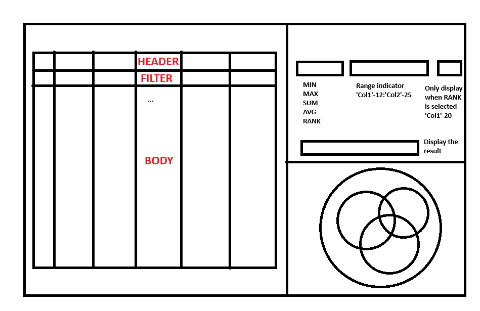

# Project: Ranking System (UI)

## Description
Build a ranking system with a table, a diagram, and a logical operation calculator.

## Features
- Download a dataset that contains more than 3000 records with more than 3 columns in number format.
- Should build a responsive UI like the attached screenshot.

- Should implement infinite scroll in the table, and search functionality (should use useDebounce)
- Filter for one column will contain operator dropdown(>, <, =) and input box for value.
- Should show total records, current records, records in the page, search query time, and count of searched results.
- Should implement logical operation calculator including MIN, MAX, RANK, SUM, AVG
- Should visualize the search result for 3 columns in the format in the screenshot.
  - Each circle indicates the total records, 1st column query result, 2nd column query result, 3rd column query result.
  - Show show number of records in different areas with different colors.
  - Circle size should be dependent on number of associated records.

## Screenshots


## Frontend
### Tech Stacks
- React
- TypeScript
- Vite

### Features
- 

### Challenges & Solutions
- 

## Installation

1. Clone the repository

2. Set up the node modules on both front end and back end side
- Please use Node 16.14.0

```shell
npm install
```

3. Run the program

- Front-end

```shell
npm run dev
```

4. Open your web browser and visit `http://127.0.0.1:5173/` to see the application running.